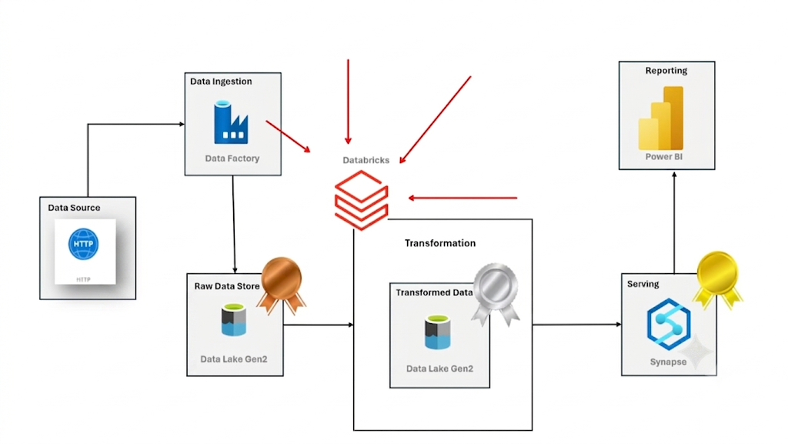

# 🚀 AdventureWorks Azure Data Engineering Pipeline

An end-to-end Azure Data Engineering project that ingests raw AdventureWorks datasets from GitHub, stores them in Azure Data Lake Storage Gen2, transforms the data using Azure Databricks (PySpark) following the Medallion Architecture, and serves analytics-ready data through Azure Synapse Analytics for reporting in Power BI.

---

## 📌 Project Overview

This project demonstrates a modern cloud-based data engineering pipeline built on Microsoft Azure. It showcases how raw enterprise data can be ingested, transformed, and served for business intelligence using industry-standard Azure services.

### Architecture




```
GitHub (CSV Files)
        │
        ▼
Azure Data Factory
        │
        ▼
Azure Data Lake Storage Gen2
      (Bronze Layer)
        │
        ▼
Azure Databricks (PySpark)
      Data Cleaning &
     Transformations
        │
        ▼
Azure Data Lake Storage Gen2
      (Silver Layer)
        │
        ▼
Azure Data Lake Storage Gen2
       (Gold Layer)
        │
        ▼
Azure Synapse Analytics
        │
        ▼
Power BI Dashboard
```
## Architecture

---

# 🛠️ Tech Stack

- Microsoft Azure
- Azure Data Factory
- Azure Data Lake Storage Gen2
- Azure Databricks
- Apache Spark (PySpark)
- Azure Synapse Analytics
- Power BI
- GitHub
- Python
- SQL

---

# 📂 Dataset

This project uses the **AdventureWorks** sample dataset developed by Microsoft.

The dataset represents a fictional bicycle manufacturing and retail company and contains information such as:

- Customers
- Products
- Product Categories
- Product Subcategories
- Sales (2015–2017)
- Territories
- Returns
- Calendar

The dataset is widely used for learning SQL, Data Warehousing, Business Intelligence, and Data Engineering concepts.

---

# ⚙️ Pipeline Workflow

## Step 1 — Data Ingestion

- Source data stored in GitHub
- Azure Data Factory copies datasets into Azure Data Lake Storage Gen2
- Raw files stored in the **Bronze Layer**

---

## Step 2 — Data Transformation

Using Azure Databricks and PySpark:

- Data Cleaning
- Handling Missing Values
- Data Type Conversion
- Filtering Invalid Records
- Joins
- Feature Engineering
- Business Rule Implementation

Processed datasets are stored in the **Silver Layer**.

---

## Step 3 — Data Modeling

Business-ready datasets are generated by:

- Joining Fact and Dimension tables
- Creating analytical datasets
- Optimizing schema for reporting

Stored in the **Gold Layer**.

---

## Step 4 — Data Serving

Gold Layer datasets are loaded into:

- Azure Synapse Analytics

This enables scalable querying and downstream reporting.

---

## Step 5 — Reporting

Power BI connects to Azure Synapse Analytics to create:

- Sales Dashboard
- Customer Insights
- Product Performance
- Territory Analysis
- Revenue Trends

---

# 🏗️ Medallion Architecture

This project follows the Medallion Architecture.

## 🥉 Bronze Layer

- Raw data
- No transformations
- Exact copy of source

---

## 🥈 Silver Layer

- Cleaned data
- Standardized schema
- Duplicate removal
- Data validation
- Business transformations

---

## 🥇 Gold Layer

- Business-ready datasets
- Aggregated tables
- Optimized for analytics
- Power BI ready

---

# 📁 Project Structure

```
AdventureWorks-Azure-Data-Engineering
│
├── datasets/
│
├── datafactory/
│
├── databricks/
│   ├── Bronze
│   ├── Silver
│   └── Gold
│
├── synapse/
│
├── powerbi/
│
├── architecture/
│
└── README.md
```

---

# 🚀 Features

- End-to-End Azure Data Engineering Pipeline
- Automated Data Ingestion
- Cloud-based ETL Pipeline
- Medallion Architecture
- PySpark Transformations
- Azure Data Lake Storage
- Azure Synapse Analytics
- Power BI Reporting
- Scalable Cloud Architecture

---

# 📊 Azure Services Used

| Service | Purpose |
|----------|----------|
| Azure Data Factory | Data Ingestion |
| Azure Data Lake Storage Gen2 | Data Storage |
| Azure Databricks | Data Processing |
| Apache Spark (PySpark) | Distributed Data Processing |
| Azure Synapse Analytics | Data Serving |
| Power BI | Reporting & Visualization |

---

# 🎯 Learning Outcomes

This project demonstrates practical knowledge of:

- Azure Cloud
- Data Engineering
- ETL / ELT Pipelines
- Apache Spark
- PySpark
- Data Lake Architecture
- Medallion Architecture
- Azure Synapse Analytics
- Business Intelligence
- Power BI

---

# 📸 Project Screenshots

> Add screenshots here after completing the project.

Examples:

- Azure Data Factory Pipeline
- Azure Data Lake Storage
- Azure Databricks Notebook
- Synapse Tables
- Power BI Dashboard

---

# 🔮 Future Improvements

- CI/CD using Azure DevOps
- Incremental Data Loading
- Delta Lake Implementation
- Data Quality Monitoring
- Pipeline Scheduling
- Parameterized Pipelines
- Unit Testing
- Data Validation Framework

---

# 👨‍💻 Author

**Karthik Maiya**

GitHub: *(Add your GitHub link here)*

---

# ⭐ If you found this project useful, consider giving it a star!
